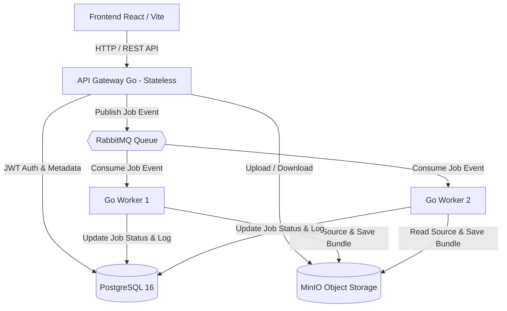

# Plan de Implementación Paso a Paso: Plataforma OKF Converter

Este documento presenta la propuesta arquitectónica, la selección de tecnologías y la hoja de ruta en 5 fases para implementar de forma completa y robusta la plataforma de conversión documental a bundles OKF.

---

## Selección de Tecnologías (Tech Stack Proposed)

Basado en las restricciones del documento (Go + Docker Compose obligatorios) y buscando el máximo rendimiento, confiabilidad y facilidad de demostración en la sustentación:

| Componente | Tecnología Seleccionada | Justificación |
| :--- | :--- | :--- |
| **Backend API** | **Go 1.22+** (Framework `Gin` o `Chi` + standard `net/http`) | Go es obligatorio. `Chi` / `Gin` son ligeros, eficientes y permiten estructurar endpoints REST limpios, DTOs y middlewares de autenticación JWT. |
| **Backend Workers** | **Go 1.22+** (Workers independientes) | Go es obligatorio. Consumidores amqplib/go multithreaded que ejecutan la conversión, validan y persisten de forma asíncrona e idempotente. |
| **Cola de Mensajes** | **RabbitMQ** (`rabbitmq:3-management-alpine`) | Protocolo AMQP estándar. Garantiza desacoplamiento total, confirmaciones de procesamiento (ACK/NACK), durabilidad de mensajes e inspección visual en su dashboard web (puerto 15672). |
| **Base de Datos Metadatos** | **PostgreSQL 16** (`postgres:16-alpine`) | Persistencia relacional sólida con soporte nativo de UUIDs, restricciones de unicidad (para idempotencia) y aislamiento multitenant. |
| **Object Storage** | **MinIO** (`minio/minio`) | Solución de almacenamiento de objetos 100% compatible con AWS S3 API. Permite almacenar archivos originales y bundles fuera del disco efímero de los contenedores. |
| **Frontend** | **React + Vite + Vanilla CSS / Tailwind** | Interfaz SPA moderna, ultra rápida, en modo oscuro con estética *glassmorphism*, monitoreo de estado en tiempo real (polling), carga de archivos interactiva, visores y descarga de bundles ZIP. |
| **Orquestación & Env** | **Docker Compose** + `.env` | Un único comando `docker compose up --build` levanta los 6 servicios interconectados a través de una red interna bridge. |

---

## Arquitectura de Servicios en Docker Compose

---

## User Review Required

> [!IMPORTANT]
> **Revisión de Decisiones Técnicas:**
> 1. **Cola de Mensajes:** Se ha seleccionado **RabbitMQ** por su robustez en ack/nack e interfaz de monitoreo visual en el video. ¿Estás de acuerdo o prefieres **Redis Streams**?
> 2. **Object Storage:** Se utilizará **MinIO** para simular un AWS S3 local compatible. ¿Te parece bien esta opción?
> 3. **Formatos de Entrada:** Implementaremos **Markdown** y **HTML / Texto con Encabezados Markdown** como formatos base obligatorios, y dejaremos la puerta abierta para agregar **TXT/DOCX** como alcance opcional si el tiempo lo permite.

---

## Open Questions

> [!NOTE]
> No hay preguntas abiertas bloqueantes. Si estás de acuerdo con el stack propuesto, procederemos con la Fase 1 inmediatamente.

---

## Hitos de Implementación (Fases Paso a Paso)

### Fase 1: Estructura del Repositorio y Entorno Docker Compose (Día 1)
* **[NEW]** Archivo `docker-compose.yml` configurando los 6 servicios: `postgres`, `rabbitmq`, `minio`, `api`, `worker`, `frontend`.
* **[NEW]** Archivo `.env.example` y `.env` para la gestión centralizada de secretos y credenciales.
* **[NEW]** Configuración inicial del módulo Go (`go.mod`) con la estructura de paquetes organizada (`cmd/api`, `cmd/worker`, `internal/config`, `internal/domain`, `internal/repository`, `internal/service`).

### Fase 2: Base de Datos, Storage y Autenticación en API Go (Día 2)
* **[NEW]** Migraciones SQL de PostgreSQL:
  * Tabla `users` (id, email, password_hash, created_at).
  * Tabla `jobs` (id, user_id, original_filename, file_key, bundle_key, status, error_message, created_at, updated_at).
  * Tabla `bundle_logs` (id, job_id, step, status, details, timestamp).
* **[NEW]** Integración de cliente MinIO en Go para subir/descargar objetos.
* **[NEW]** Enpoints de Autenticación de la API: `POST /api/auth/register`, `POST /api/auth/login` (con JWT).
* **[NEW]** Middleware de Seguridad JWT para validar tokens y extraer el `user_id` en las rutas protegidas.

### Fase 3: Asincronía, Encolamiento y Conversor/Worker Go (Día 3-4)
* **[NEW]** Enpoint de Carga: `POST /api/jobs/upload` (sube archivo a MinIO, registra job `PENDING` en BD, publica mensaje `{job_id, user_id, file_key}` en RabbitMQ y retorna HTTP 202 con el `job_id` de inmediato).
* **[NEW]** Servicio de Cola RabbitMQ en Go (Publicador y Consumidor con canal persistente y acknowledgements).
* **[NEW]** Motor de Conversión de Bundles OKF en Go (`internal/converter`):
  * Lógica de parsing y segmentación por encabezados (`#`, `##`).
  * Generación de archivos individualizados (`capitulo-01.md`, `capitulo-02.md`, etc.).
  * Generación de `index.md` con enlaces hipervinculados navegables.
  * Generación de `log.md` con trazabilidad completa de transformaciones y validaciones.
  * Compresión del bundle en un paquete ZIP guardado en MinIO.
* **[NEW]** Módulo de Validación del Bundle (`internal/validator`):
  * Comprobar presencia física de `index.md` y `log.md`.
  * Comprobar integridad de enlaces Markdown entre `index.md` y los archivos de concepto.
* **[NEW]** Control de Idempotencia: Verificar en BD si el `job_id` ya fue procesado antes de rehacer la conversión.

### Fase 4: Endpoints de Consulta, Descarga y Aislamiento (Día 5)
* **[NEW]** `GET /api/jobs`: Lista todos los trabajos del usuario autenticado.
* **[NEW]** `GET /api/jobs/{id}`: Detalle del trabajo y logs de conversión (con verificación estricta de propiedad `user_id == job.user_id`).
* **[NEW]** `GET /api/jobs/{id}/download`: Transmite el archivo ZIP del bundle desde MinIO al usuario (sólo si el status es `COMPLETED` y pertenece al usuario).

### Fase 5: Frontend React (Vite) y Pulido de Experiencia de Usuario (Día 6-7)
* **[NEW]** SPA en React + Vite con diseño Premium/Glassmorphism (Dark Mode):
  * Vista de Autenticación (Login / Registro).
  * Dashboard de Carga de Documentos con Drag & Drop.
  * Tabla/Tarjetas de Trabajos en Tiempo Real (polling automático de status).
  * Modal/Visor del Bundle (visualización de `index.md`, `log.md` y conceptos directamente en la web).
  * Botón de Descarga del Bundle `.zip`.
* **[NEW]** Pruebas de integración de las 6 Condiciones Verificables:
  1. Carga no bloqueante + cierre de pestaña.
  2. Documento breve (1 solo concepto).
  3. Documento estructurado (múltiples conceptos).
  4. Rechazo de bundle incompleto.
  5. Intento de acceso a ID ajeno (Denegación 403).
  6. Idempotencia ante mensajes duplicados en la cola.

---

## Plan de Verificación

### Pruebas Automatizadas
- Unit tests en Go para la segmentación Markdown y el validador del bundle OKF:
  `go test ./internal/converter/... ./internal/validator/...`
- Test de integración del flujo de base de datos y colas.

### Verificación Manual
1. Levantar el proyecto completo con un solo comando: `docker compose up --build`.
2. Probar registro de 2 usuarios distintos (Usuario A y Usuario B).
3. Subir documento estructurado con Usuario A, obtener `job_id`, verificar en RabbitMQ dashboard y en la BD que cambia a `COMPLETED`.
4. Intentar consultar el `job_id` del Usuario A usando el token del Usuario B y verificar retorno `403 Forbidden`.
5. Descargar el bundle `.zip`, descomprimir e inspeccionar la presencia de `index.md`, `log.md` y archivos de conceptos correctamente enlazados.
